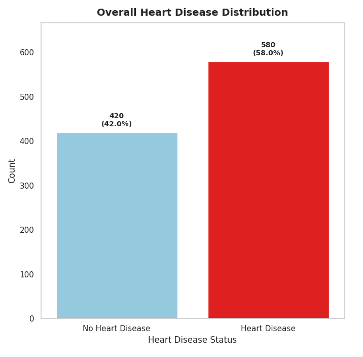
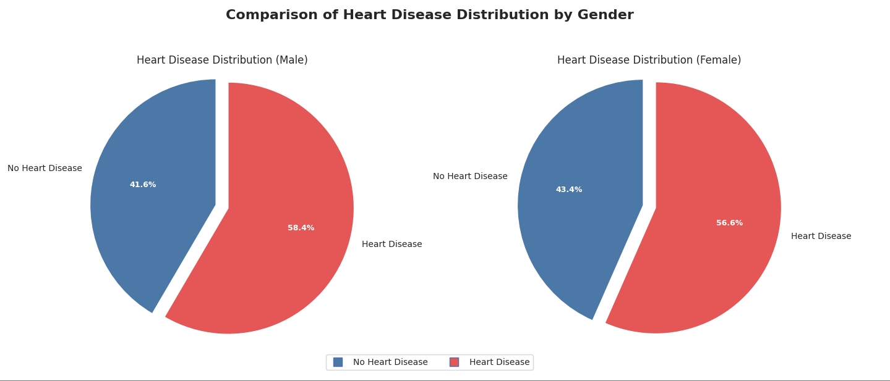
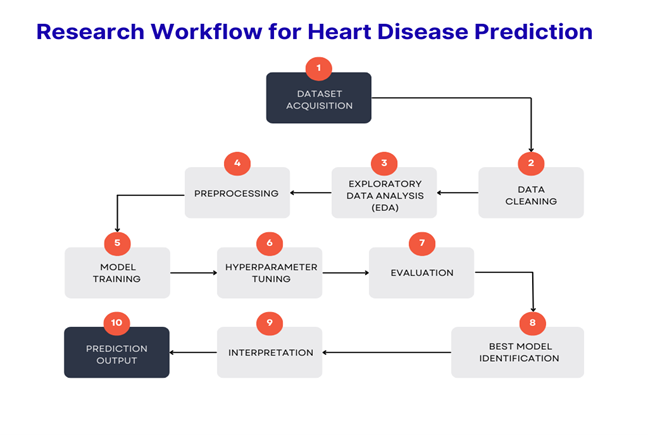
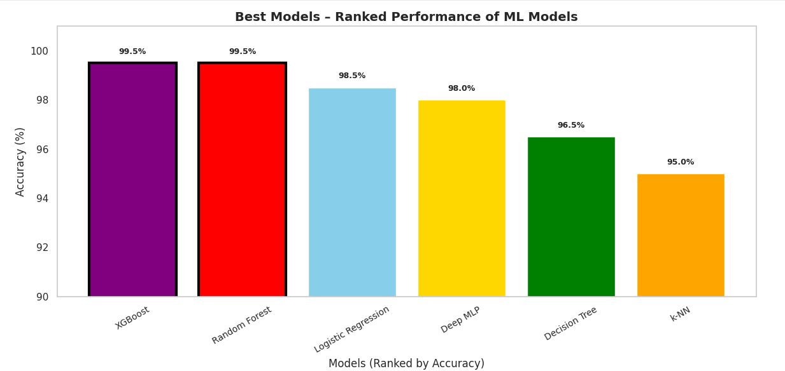
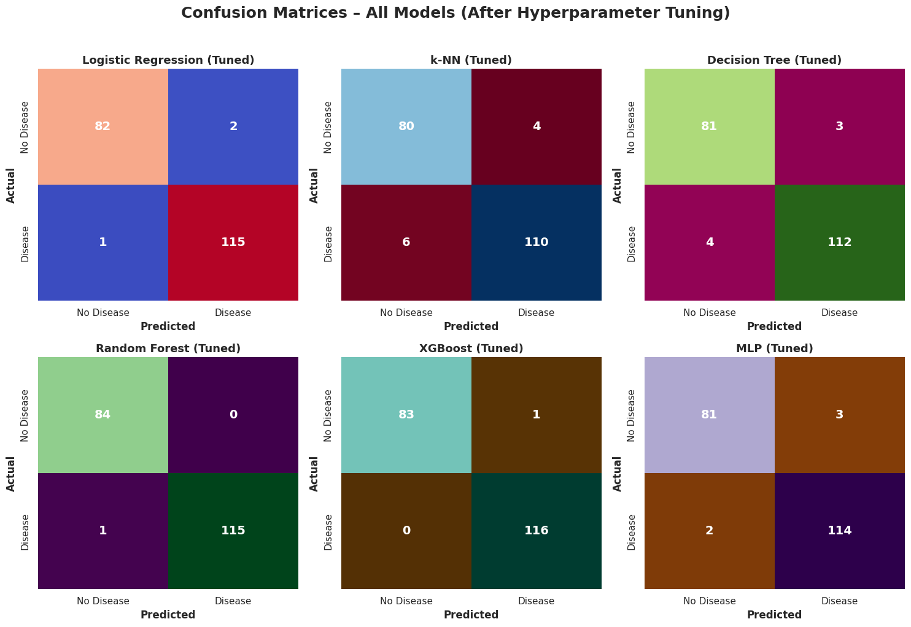
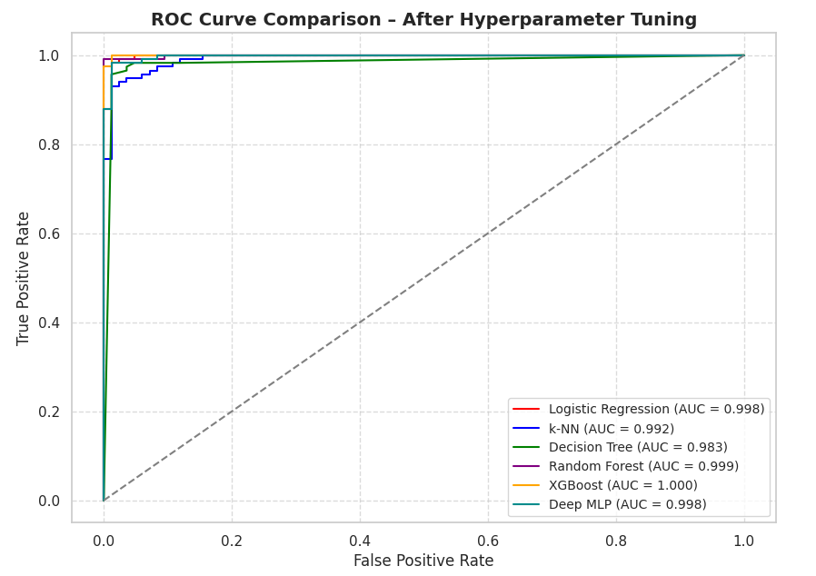

# Cardiovascular Disease Prediction Using Machine Learning

📊 **Predictive Analytics and Clinical Risk Stratification Using Supervised Machine Learning**

This repository presents a complete predictive analytics framework developed to identify individuals at risk of cardiovascular disease using supervised machine learning techniques. The project was completed as part of a postgraduate dissertation and is written to a professional academic standard, with strong emphasis on clarity, reproducibility, interpretability, and real-world applicability.

**Cardiovascular disease remains the leading cause of mortality worldwide.** Early identification of high-risk individuals is critical, yet traditional diagnostic pathways are often reactive, resource-intensive, and dependent on specialist expertise. This project demonstrates how machine learning can complement clinical judgement by analysing routinely collected clinical variables and estimating patient risk in a systematic, transparent, and evidence-driven manner.

This repository serves as the **central project hub**, with:
- Full execution supported via **Google Colab**
- Complete project files available via **Google Drive** for easy download and review

---

## 🎯 Project Aim

The primary aim of this project is to evaluate the effectiveness of multiple supervised machine learning algorithms in predicting the presence of cardiovascular disease from structured clinical data.

A comparative modelling strategy is adopted to assess linear, tree-based, distance-based, ensemble, and neural approaches under a unified experimental framework. Each model is developed, optimised, and evaluated using consistent preprocessing, validation, and performance metrics to ensure fair and reliable comparison.

Beyond predictive accuracy, the project prioritises **methodological rigour**, **model interpretability**, and the **responsible application of artificial intelligence in healthcare**, ensuring that outputs remain clinically meaningful and suitable for decision-support contexts.

---

## 📌 Research Objectives

This project was guided by a set of clearly defined research objectives designed to ensure robustness, transparency, and clinical relevance.

The specific objectives are to:

- Implement and compare multiple supervised machine learning algorithms for binary classification of cardiovascular disease.
- Develop a robust preprocessing pipeline incorporating data cleaning, duplicate removal, categorical encoding, outlier handling, and feature standardisation.
- Apply five-fold cross-validation and systematic hyperparameter optimisation to reduce overfitting and improve model generalisability.
- Evaluate model performance using clinically meaningful metrics, including accuracy, precision, recall, F1-score, and ROC-AUC.
- Integrate model interpretability techniques, including feature importance analysis and SHAP values, to enhance transparency and clinical trust.
- Address ethical, legal, and data-protection considerations in line with GDPR and healthcare AI governance guidelines.
- Explore potential deployment pathways such as clinical decision-support systems and mobile or web-based health applications.

---

## 📁 Dataset

The dataset used in this project is the **Cardiovascular Disease Dataset** obtained from Kaggle.

**Dataset details:**

- **Source:** https://www.kaggle.com/datasets/jocelyndumlao/cardiovascular-disease-dataset  
- **Number of records:** 1,000 anonymised patient cases  
- **Number of features:** 13 clinically recognised predictors  
- **Target variable:** Binary indicator of heart disease presence  
  - `0` = No heart disease  
  - `1` = Heart disease  

The dataset is derived from the UCI Cleveland Heart Disease dataset and has been expanded and cleaned to support robust model training and evaluation. It includes demographic, physiological, electrocardiographic, exercise-related, and angiographic attributes such as age, sex, blood pressure, cholesterol, chest pain type, ST-segment characteristics, and number of major vessels.

> ⚠️ **Important:**  
> The dataset is not included in this repository due to licensing, ethical, and data governance considerations.  
> To reproduce the results, users should download the dataset directly from Kaggle and place the CSV file in the `data/` directory, following the instructions provided in the notebook.

---

## 📊 Exploratory Data Analysis (EDA)

A focused exploratory data analysis was conducted to assess class balance and basic demographic patterns within the dataset. The objective of this stage was to validate data suitability for supervised learning while maintaining clarity and clinical relevance. Detailed exploratory analysis is documented within the project notebook.

### Target Variable Distribution

The dataset shows a reasonably balanced distribution between patients with and without cardiovascular disease. This balance supports reliable model training and evaluation without severe class bias.

### Heart Disease Distribution by Gender

The prevalence of cardiovascular disease is broadly comparable across male and female patients. This indicates that the dataset does not suffer from significant gender imbalance and supports fair model evaluation across demographic groups.

---

## 🔄 Research Workflow

The project follows a structured and reproducible machine learning workflow designed to ensure methodological rigour, transparency, and clinical relevance. Each stage is implemented sequentially and documented within the notebook to support reproducibility and critical evaluation.

The workflow consists of the following stages:

1. **Dataset Acquisition**  
   Cardiovascular disease data is sourced from Kaggle and reviewed for completeness and clinical plausibility.

2. **Data Cleaning and Validation**  
   Duplicate records are removed, identifier variables are dropped, and the dataset is checked for missing or inconsistent values.

3. **Exploratory Data Analysis**  
   Feature distributions, correlations, and outcome relationships are analysed to inform preprocessing and modelling decisions.

4. **Preprocessing and Feature Engineering**  
   Categorical variables are encoded using clinically meaningful mappings, numerical features are standardised, and an 80:20 stratified train–test split is applied.

5. **Model Training**  
   Multiple supervised learning models are trained, including linear, tree-based, ensemble, distance-based, and neural approaches.

6. **Hyperparameter Optimisation**  
   Model-specific hyperparameters are tuned using GridSearchCV and RandomisedSearchCV within five-fold cross-validation.

7. **Model Evaluation**  
   Performance is assessed using accuracy, precision, recall, F1-score, ROC-AUC, and confusion matrices.

8. **Model Interpretability**  
   Feature importance analysis and SHAP values are applied to explain predictions and identify influential clinical risk factors.

9. **Prediction Output**  
   Final model outputs classify patients as **Heart Disease** or **No Heart Disease**, supporting clinical risk stratification.

### Visual Workflow Diagram

The figure below provides a visual overview of the complete research workflow, from dataset acquisition through to model interpretation and final prediction.

## 🤖 Machine Learning Models & Hyperparameter Tuning

To assess the suitability of different modelling approaches for cardiovascular disease prediction, multiple supervised machine learning algorithms were implemented and evaluated under a consistent experimental framework. The selected models span linear, tree-based, ensemble, distance-based, and neural paradigms, allowing for a balanced comparison between interpretability and predictive performance.

### Implemented Models

**Logistic Regression**  
A linear baseline model widely used in clinical research. It provides interpretable coefficients and odds ratios, making it suitable for understanding the directional influence of individual risk factors.

**Decision Tree**  
A rule-based classifier that models decision logic using hierarchical splits. While highly interpretable, constraints on depth and split criteria are required to mitigate overfitting.

**Random Forest**  
An ensemble method based on bootstrap aggregation of decision trees. It improves robustness and generalisation by reducing variance and capturing non-linear feature interactions.

**XGBoost (Extreme Gradient Boosting)**  
A gradient-boosted ensemble model that builds trees sequentially, correcting previous errors. It is well suited to structured clinical data and incorporates regularisation to control overfitting.

**k-Nearest Neighbours (k-NN)**  
A distance-based classifier that assigns class labels based on the majority class among the nearest observations. Performance is sensitive to feature scaling and the choice of neighbourhood size.

**Multi-Layer Perceptron (MLP)**  
A feedforward neural network implemented using TensorFlow and Keras. The MLP captures complex non-linear relationships between clinical variables but requires careful tuning to ensure stable convergence.

---

### Hyperparameter Optimisation

Hyperparameter tuning was conducted to optimise model performance and improve generalisability. Two systematic search strategies were employed:

- **GridSearchCV** for exhaustive evaluation of smaller parameter spaces  
- **RandomisedSearchCV** for efficient exploration of larger parameter spaces  

All hyperparameter tuning was embedded within **five-fold cross-validation**, ensuring that performance estimates were not dependent on a single train–test split.

Examples of tuned hyperparameters included:

- Regularisation strength and solver selection for Logistic Regression  
- Tree depth, split criteria, and minimum samples per node for Decision Trees  
- Number of estimators, feature sampling, and depth constraints for Random Forest  
- Learning rate, maximum depth, subsampling ratios, and regularisation terms for XGBoost  
- Number of neighbours, distance metrics, and weighting schemes for k-NN  
- Network architecture, activation functions, learning rate, batch size, and training epochs for the MLP  

This optimisation process ensured that each model was evaluated under its most effective configuration, enabling fair and reliable comparison across algorithms.

## 📈 Evaluation & Results

Model performance was evaluated using clinically meaningful and statistically robust metrics, including **accuracy**, **precision**, **recall**, **F1-score**, **ROC-AUC**, and **confusion matrices**. This evaluation strategy reflects the asymmetric risk of misclassification in healthcare, where false negatives and false positives have different clinical implications.

### 🔢 Performance Summary

| Model | Accuracy | Cross-Validation Score | Notes |
|------|---------|------------------------|------|
| **Random Forest** | **99.5%** | 98.3% | Strongest ensemble performance |
| **XGBoost** | **99.5%** | 98.3% | High accuracy and stable generalisation |
| **Multi-Layer Perceptron (MLP)** | 97.5% | **98.7%** | Most consistent across folds |
| Logistic Regression | 98.5% | – | Strong, interpretable baseline |
| Decision Tree | 96.5% | – | Transparent but prone to overfitting |
| k-Nearest Neighbours | 95.0% | – | Sensitive to feature scaling |

---

### 📊 Model Accuracy Comparison

The following visual compares classification accuracy across all evaluated models, highlighting the superior performance of ensemble and neural approaches.

---

### 🧪 Confusion Matrix (Best Performing Model)

The confusion matrix below illustrates the classification performance of the **Random Forest model**, which achieved the highest overall accuracy. The low false-negative rate is particularly important in a clinical risk prediction context.

---

### 📈 ROC Curve Analysis

Receiver Operating Characteristic (ROC) curves demonstrate each model’s ability to discriminate between patients with and without cardiovascular disease across all decision thresholds.

Random Forest and XGBoost exhibit near-perfect discrimination, confirming their suitability for structured clinical prediction tasks.

## ⚖️ Ethical & Legal Considerations

The project adheres to principles of responsible artificial intelligence in healthcare. Key considerations include:

- Exclusive use of **anonymised patient data**
- Alignment with **GDPR** principles of lawful processing, data minimisation, and purpose limitation
- Consideration of **bias, fairness, and false-negative risk**
- Emphasis on **human oversight**, with models designed to support rather than replace clinical judgement

These considerations are critical to ensuring that predictive analytics tools can be safely and ethically integrated into real-world healthcare environments.

---

## ▶️ Running the Entire Project

### Google Colab

The full implementation is available as an executable Google Colab notebook, allowing users to run the project without local setup.

**Google Colab link:**  
https://colab.research.google.com/drive/1CbTZWrcO75L-I_5Qc1qBw5845pTTBhkI?usp=sharing

---

### Full Project Files (Google Drive)

A complete downloadable version of the project, including the notebook, dissertation report, and generated results, is available via Google Drive.

**Google Drive link:**  
(https://drive.google.com/file/d/1rlo1Jr_Lok9qiHrga1UgBn1GCpSjNhe0/view?usp=sharing)

## Acknowledgements

-This project uses publicly available data from Kaggle and draws upon established research in cardiovascular medicine and machine learning. It has been developed with an academic commitment to transparency, reproducibility, and the  responsible application of artificial intelligence in healthcare.

